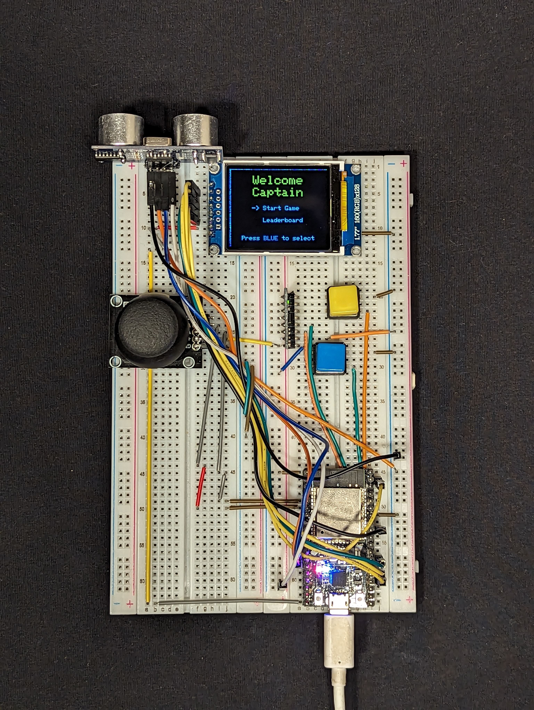

# Table of Contents

 

1. [HELLO CAPTAIN!](#hello-captain)
2. [Software Setup](#software-setup)
   - [Dependencies](#dependencies)
   - [Configuration](#configuration)
      - [Network and Database Connexions](#network-and-database-connexions)
      - [TFT_eSPI Configuration](#tft_espi-configuration)
3. [Hardware Setup](#hardware-setup)
   - [Components Used](#components-used)
   - [Wiring Instructions](#wiring-instructions)
4. [Running the Project](#running-the-project)
5. [License](#license)

# HELLO CAPTAIN!

This project is an ESP32 based game and gaming devices that uses unconventional controls. This README will guide you through the setup process for both the software and hardware components of the project.  
  
The project was realised for the IoT Experimental Project course from  Haaga-Helia University of Applied Sciences.

## Software Setup

### Dependencies

This project requires the following librairies:
- [TFT_eSPI](https://github.com/Bodmer/TFT_eSPI)
- [Firebase_Arduino_Client_Library_for_ESP8266_and_ESP32](https://github.com/mobizt/Firebase-ESP-Client)
- [MPU6050 for ESP32](https://github.com/jrowberg/i2cdevlib/tree/master/ESP32_ESP-IDF/components/MPU6050)
- [I2Cdev for ESP32](https://github.com/jrowberg/i2cdevlib/tree/master/ESP32_ESP-IDF/components/I2Cdev)

### Configuration

#### Network and Database Connexions

To configure the project, follow these steps:

1. Navigate to the `/src/network/` directory of your project.

2. Create a new file named `config.cpp`.

3. Add the following code block to `config.cpp`, replacing placeholders with your actual credentials:

```cpp
#include "config.h"

const char *ssid = "your_wifi_ssid";
const char *password = "your_wifi_password";
const char *apiKey = "your_api_key";
const char *databaseUrl = "your_database_url";
```
Note: if you are reproducing this project from scratch you will have to create a Realtime Database in a new Firebase project

#### TFT_eSPI Configuration
The [TFT_eSPI](https://github.com/Bodmer/TFT_eSPI) library requires some configuration in the User_Setup.h file. See the comments in the file for instructions.
In our project, we used the a 160x128 ST7735 GREENTAB display, for reference here is the User_Setup.h file, without comments, that we use :
```
#define USER_SETUP_INFO "User_Setup"

#define ST7735_DRIVER // Define additional parameters below for this display

#define TFT_RGB_ORDER TFT_RGB // Colour order Red-Green-Blue
#define TFT_WIDTH 128
#define TFT_HEIGHT 160
#define ST7735_GREENTAB

#define TFT_CS 15 // Chip select control pin
#define TFT_DC 2  // Data Command control pin
#define TFT_RST 4 // Reset pin (could connect to RST pin)

#define LOAD_GLCD  // Font 1. Original Adafruit 8 pixel font needs ~1820 bytes in FLASH
#define LOAD_FONT2 // Font 2. Small 16 pixel high font, needs ~3534 bytes in FLASH, 96 characters
#define LOAD_FONT4 // Font 4. Medium 26 pixel high font, needs ~5848 bytes in FLASH, 96 characters
#define LOAD_FONT6 // Font 6. Large 48 pixel font, needs ~2666 bytes in FLASH, only characters 1234567890:-.apm
#define LOAD_FONT7 // Font 7. 7 segment 48 pixel font, needs ~2438 bytes in FLASH, only characters 1234567890:-.
#define LOAD_FONT8 // Font 8. Large 75 pixel font needs ~3256 bytes in FLASH, only characters 1234567890:-.
#define LOAD_GFXFF // FreeFonts. Include access to the 48 Adafruit_GFX free fonts FF1 to FF48 and custom fonts

#define SMOOTH_FONT

#define SPI_FREQUENCY 27000000

// Optional reduced SPI frequency for reading TFT
#define SPI_READ_FREQUENCY 20000000

// The XPT2046 requires a lower SPI clock rate of 2.5MHz so we define that here:
#define SPI_TOUCH_FREQUENCY 2500000

```

## Hardware Setup

### Components Used

- ESP32 microcontroller 
- TFT LCD display 160x128 ST7735
- Buttons for input
- Joystick
- HC-SR04 
- GY-521 

### Wiring Instructions

- TFT LCD Display:
  - GND  -> GND
  - VCC  -> 5V
  - SCK  -> D18
  - SDA  -> D23
  - RES  -> D4
  - RS   -> D2
  - CS   -> D15
  - LEDA -> 3V3

- Buttons:
  - Blue 1 -> P17
  - Blue 2 -> GND
  - Yellow 1 -> P19
  - Yellow 2 -> GND

- Joystick:
  - GND  -> GND
  - VCC  -> 5V
  - VRx -> P34
  - VRy -> P35
  - SW -> Not Used

- HC-SR04 Ultrasonic Sensor:
  - VCC -> 3V3
  - Trig -> P12
  - Echo -> P14
  - GND -> GND

- GY-521 Accelerometer/Gyroscope Module:
  - VCC -> 3V3
  - GND -> GND
  - SCL -> P22
  - SDA -> P21
  - Other pins are not used
    
## Running the Project

Once you have completed the software and hardware setup, you can upload the project to your ESP32 board using the Arduino IDE or your preferred IDE. After uploading, the game should start running on your ESP32 device.

## License
To be discussed

